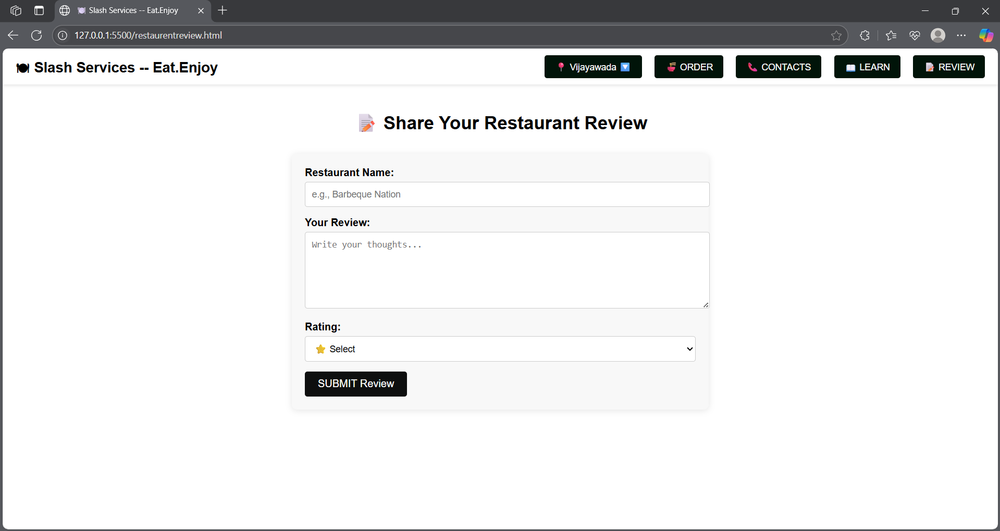
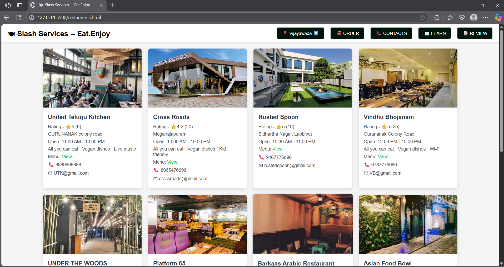

# slashservices

## Overview

It is a sample frontend webapplication to see the information of the restaurents in the city.
in this webpage we have a effective User Interface. we can easily move from one page to other page easily.
It is a very user-friendly interface.
Customers can also give reviews for the restaurents.

### TechStack:
HTML, CSS and JAVASCRIPT.
Customers can also give reviews for the restaurents.

## Screenshots

